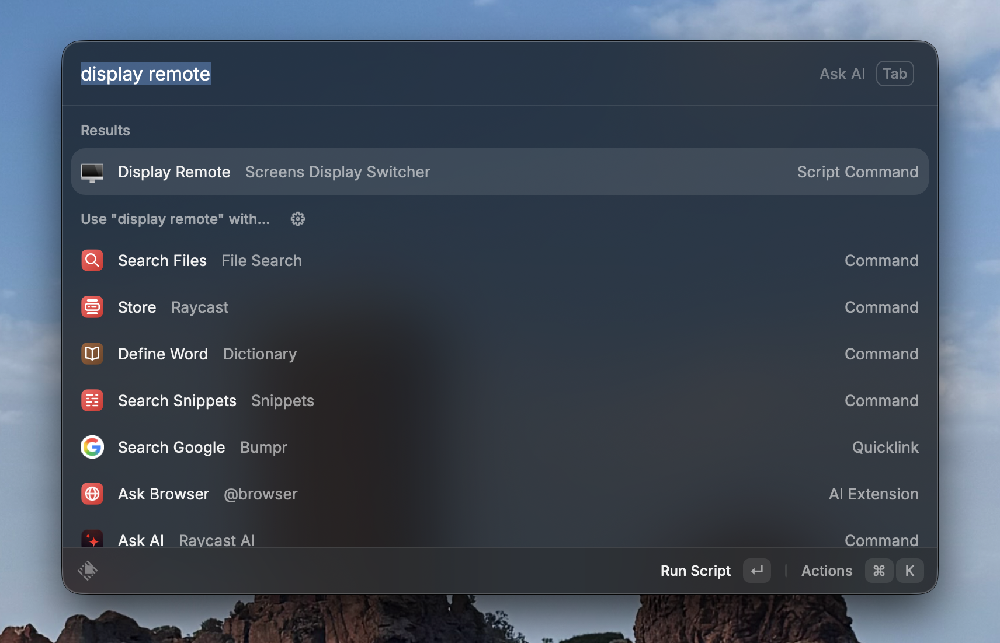

# screens-display-switcher

Manual macOS display layout and resolution switching for
[Screens](https://www.edovia.com/en/screens/)/VNC workflows, with optional
launchers for Raycast, Keyboard Maestro, and any other tool that can run a
shell script.

The host runs at its native resolution day-to-day. Before connecting via
Screens.app, run `d remote` to switch to a smaller, remote-friendly mirror
layout. After disconnecting, run `d restore` to return to the native local
layout.



*Example: launching the remote display layout from Raycast.*

The default setup is:

- `d remote`: remote-friendly mirror layout for Screens.app/VNC.
- `d restore`: normal local display layout.

The reliable workflow is explicit:

1. Run `d remote`, or run `scripts/display-remote.sh`.
2. Connect with Screens.app.
3. Run `d restore`, or run `scripts/display-restore.sh`, when done.

The scripts use [`displayplacer`](https://github.com/jakehilborn/displayplacer)
under the hood, plus optional [BetterDisplay](https://github.com/waydabber/BetterDisplay)
support for layouts that involve a virtual display.

```sh
brew install displayplacer
brew install waydabber/betterdisplay/betterdisplaycli   # only if you use a virtual display
```

## Setup

From this directory:

```sh
./scripts/install.sh
```

Set your display to its normal local layout, then capture it:

```sh
./scripts/capture-layout.sh local
```

Set your display to the layout you want for Screens remote access, then capture
it:

```sh
./scripts/capture-layout.sh remote
```

This creates:

```txt
layouts/local.displayplacer
layouts/remote.displayplacer
```

If your remote layout uses a BetterDisplay virtual display (recommended for
Screens.app, since macOS otherwise streams the host's full physical display
resolution), see [Using a BetterDisplay virtual display](#using-a-betterdisplay-virtual-display)
below for the directives to add to `layouts/remote.displayplacer`.

## Use

Before connecting remotely, run the remote layout:

```txt
d remote
```

Or from the shell:

```sh
./scripts/display-remote.sh
```

After disconnecting and returning to the Mac locally, restore the local layout:

```txt
d restore
```

```sh
./scripts/display-restore.sh
```

## Using a BetterDisplay virtual display

For Screens.app workflows, the most useful pattern is to mirror the physical
display to a smaller BetterDisplay virtual display. The virtual display
becomes the mirror master at the smaller resolution, and Screens streams
that. This is the same shape Astropad Workbench uses internally.

Add two comment directives to `layouts/remote.displayplacer`:

```txt
# betterdisplay: connect-all-displays
# betterdisplay-create: --type=VirtualScreen --virtualScreenName=ScreensRemote --virtualScreenSerial=313775617 --virtualScreenVendorNumber=2198 --virtualScreenModelNumber=10498 --aspectWidth=16 --aspectHeight=9 --resolutionList=1920x1080 --useResolutionList=on --virtualScreenHiDPI=on
displayplacer "id:s313775617+s1879776955 res:1920x1080 hz:60 color_depth:4 enabled:true scaling:on origin:(0,0) degree:0"
```

When the `betterdisplay: connect-all-displays` directive is present,
`display-remote.sh` will:

1. Discard any existing BetterDisplay virtual screen matching
   `--virtualScreenName` (defensive — prevents stale records from accumulating
   across sessions).
2. Run `betterdisplaycli create` with the arguments from
   `betterdisplay-create:`.
3. Connect the new virtual display via the BetterDisplay URL scheme (the CLI
   form is sometimes unreliable).
4. Apply the `displayplacer` mirror layout.

The matching `layouts/local.displayplacer` discards the virtual display so
it disappears between sessions:

```txt
# betterdisplay-discard: --type=VirtualScreen --name=ScreensRemote
displayplacer "id:s1879776955 res:3200x1800 hz:60 color_depth:8 enabled:true scaling:on origin:(0,0) degree:0"
```

When the `betterdisplay-discard:` directive is present,
`display-restore.sh` runs `betterdisplaycli discard <args>` after applying
the displayplacer layout, looping until nothing matches (so any duplicate
records get cleaned up in one pass).

Why discard rather than disable (`enabled:false`): BetterDisplay's CLI for
reconnecting a previously-disabled virtual display is unreliable, so disabling
on restore would put the next `d remote` on a brittle reconnect path. Discard
+ recreate is reliable; the next `d remote` creates a fresh virtual display
from the `betterdisplay-create:` directive.

## Raycast

This repo includes Raycast Script Commands in `raycast/`:

```txt
raycast/
  raycast-display-remote.sh
  raycast-display-restore.sh
```

To use them:

1. Open Raycast Preferences.
2. Go to Extensions -> Script Commands.
3. Add this folder as a script directory:

```txt
/path/to/screens-display-switcher/raycast
```

4. Search Raycast for:

```txt
d remote
d restore
```

You can assign hotkeys to either command from Raycast Preferences.

The Raycast commands are thin wrappers around `scripts/display-remote.sh` and
`scripts/display-restore.sh`, so capture and edit layouts in the same place.

## Keyboard Maestro

Keyboard Maestro can run the same shell scripts directly.

Create a macro for the remote layout:

```txt
Macro: d remote
Trigger: your preferred hotkey, menu item, Stream Deck button, or typed string
Action: Execute Shell Script
Script: /path/to/screens-display-switcher/scripts/display-remote.sh
```

Create a second macro for restoring the local layout:

```txt
Macro: d restore
Trigger: your preferred hotkey, menu item, Stream Deck button, or typed string
Action: Execute Shell Script
Script: /path/to/screens-display-switcher/scripts/display-restore.sh
```

Replace `/path/to/screens-display-switcher` with the path where you cloned this
repo.

Raycast and Keyboard Maestro both call the same scripts, so the captured layout
files stay in one place.

You can also pass an explicit layout path:

```sh
./scripts/display-remote.sh layouts/some-other-remote.displayplacer
./scripts/display-restore.sh layouts/some-other-local.displayplacer
```

## Files

- `scripts/capture-layout.sh`: saves the current `displayplacer` command.
- `scripts/display-remote.sh`: applies `layouts/remote.displayplacer`.
- `scripts/display-restore.sh`: applies `layouts/local.displayplacer`.
- `scripts/install.sh`: checks dependencies and marks scripts executable.
- `raycast/raycast-display-remote.sh`: Raycast command for the remote layout.
- `raycast/raycast-display-restore.sh`: Raycast command for restoring the local layout.
- `layouts/*.example`: placeholders showing the expected file format.
- `layouts/*.displayplacer`: local captured display layouts, ignored by Git.

## Notes

`displayplacer list` prints a restorable command for the current display
arrangement. `capture-layout.sh` extracts that command and stores it in a layout
file. Layout files are plain text so you can inspect or edit them.

The switch scripts refuse to run `.example` files or placeholder commands. This
is intentional: capture real layouts first.

## Troubleshooting

### Curtain mode (Screens.app privacy feature) suppresses display changes

If you have curtain mode engaged when `d remote` runs, the resolution change
will not take effect until curtain mode is disengaged. macOS appears to defer
display reconfiguration while curtain mode is active.

Workaround: run `d remote` *before* engaging curtain mode (i.e. before
connecting via Screens.app and before turning on curtain mode), not after.

### Apple Silicon: color depth is not configurable via BetterDisplay

`betterdisplaycli` cannot set color depth on Apple Silicon Macs (per its own
help text). Layouts in this repo use whatever color depth BetterDisplay assigns
by default; the `color_depth:` token in displayplacer commands captures the
value at capture time and replays it via macOS's regular display APIs.

### Remote and local layouts are identical

If the switch scripts report that remote and local layouts are identical, both
captured layout files contain the same `displayplacer` command. Running the
switch would not change the display, so the scripts stop instead of silently
doing nothing.

Set the display to the layout you want, then recapture the matching side:

```sh
./scripts/capture-layout.sh remote
```

or:

```sh
./scripts/capture-layout.sh local
```

### `could not find res`

If `displayplacer` reports that it `could not find res:<width>x<height>`, the
requested mode is not available in the current macOS display context.

This can happen if Screens/VNC changes the active display context. macOS may
expose the display as a virtual device with a different or reduced mode list, so
a layout captured in one context may not be available in another.

Capture and apply each layout from the same kind of session whenever possible.
If `displayplacer list` only shows one available mode, there may not be another
mode for these scripts to switch to in that session.

### Stale or duplicate BetterDisplay virtual displays

If you ever hit a state where multiple virtual displays with the same name
exist in BetterDisplay, the next `d remote` run cleans them up automatically:
it issues `betterdisplaycli discard` against the layout's
`--virtualScreenName` until none remain, then creates a fresh one.

If something more fundamentally broken happens (BetterDisplay UI shows the
virtual display but `betterdisplaycli` can't see it, etc.), open the
BetterDisplay app, manually delete any leftover virtual screens, and re-run
`d remote`.

### Raycast cannot find `displayplacer`

Raycast may launch scripts with a smaller `PATH` than your shell. The scripts
prepend common Homebrew locations (`/opt/homebrew/bin` and `/usr/local/bin`) so
Raycast can find `displayplacer` when it is installed by Homebrew.

## License

MIT
